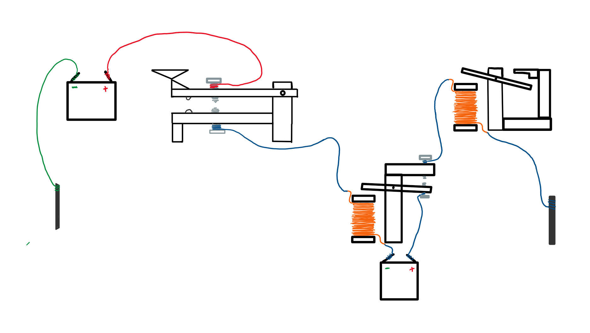
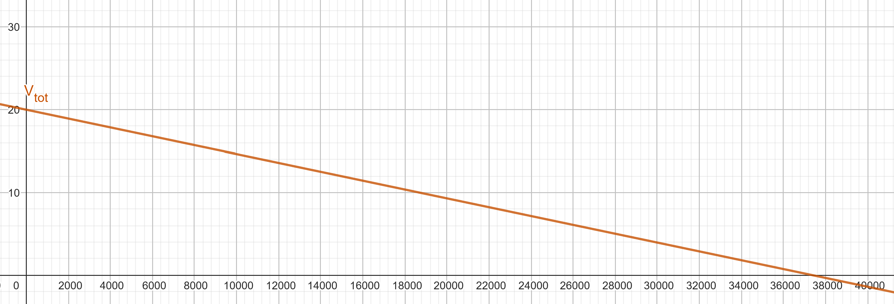
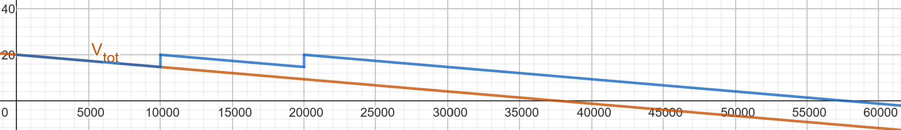

# The Telegraph 
## Introduction
Long distance communication has always been deep in the interest of human civilisation. Whether that was through smoke signals by the Native Americans, drums by African tribes, courier runners like in Ancient Greece, or sending domesticated pigeons like the Romans did, humans have always shown interest in being able to quickly send messages over a long distance within a short period of time. 
The invention of the telegraph system allowed us to send messages over a very long distance within a few seconds. It was also the first device to send messages via electricity. The telegraph is therefore an incredibly important invention in human history, and marks the beginning of long-distance communication through electricity.
## History 
Though interesting, the Chappe semaphore system, invented in 1791, was mechanical and visually based - less relevant for the electrical context.

Due to the rise in inventions in the field of electricity and magnetism, the invention of the telegraph, a device that allows communication using these new inventions, was bound to happen. The battery, magnetism, induction, electromagnets, and some others are the reason for this invention. Beforehand people only knew electricity by rubbing cloth or as lightning - so short bursts of static electricity. 

Here a short timeline of important events in the history of the telegraph:
- 1832 - Pavel Schilling, a Russian diplomat, built an electromagnetic telegraph using a wire for each letter    
- 1833 - Carl F. Gauss and Wilhelm Weber of Germany invented an electric telegraph with a needle that points to a letter  
- 1835 - Joseph Henry, an American inventor, invented a relay station to boost electric current  
- 1836 - Edward Davy invented a better relay switch in the UK  
- 1837 - Cooke and Wheatstone of the UK invented a better telegraph with 5 needles pointing to a letter  
- 1837 - Samuel Morse invents the sound based encoding system "Morse Code" and uses it in his own telegraph   

The device itself was never a dificult thing to make, what made it challenging was figuring out a way of converting messages into electricity.
Some inventions used 26 wires for one line, others used 5 for binary representation.  
The Europeans were coming up with all sorts of funny ways until an American named Samuel Morse thought of a sound based system. An electromagnet would get activated on the recieving end and pull a metal piece to it, creating a "click" sound, when released, it would produce another "clack" sound. Morse's telegraph used only a single wire. The length of each button press determined the signal: short taps for dots, longer presses for dashes. By the 1840s, due to its simplicity, the Morse telegraph became the most widespread. With this the Morse code also became international standard.

## How it works
In this project, to learn more about how the telegraph works, we will be looking at the most wide-spread and famous type of telegraph - The Morse telegraph. That's the one with the sounds and the morse code, also sometimes shown as printed dots and dashes where dots are short pauses between clicks and dashes are long pauses.

The Morse telegraph is quite simple - It is a closed circuit containing a power source, wires, a button and a sounder. 

Below is a drawing showing the sending and receiving stations respectively. 

On the left is City A. It has the telegraph key which is that big thing with red and blue wires. The two rounded parts inside are repelling magnets, and two conducting bolts each are connected to a wire. Normally these two aren't connected due to the repelling magnets. On press the two bolts are pressed together and for a short period of time they allow current to flow through to the relay station in the middle. The electromagnet activated and pulls a bar with a bolt upwards connecting two bolts once again and allowing a new battery to send current onward. This resets the circuit and the current flows to City B with the "sounder". The current activates an electromagnet that pulls a piece of metal producing a "click" sound and on release a "clack" sound. The ground is quite literally earth. Respective grounds of the batteries would be connected to metal rods and shoved in the ground. You can also connect it to your sink as in most households piping is grounded. Like that we are saving a lot of money and material on a return cable. Messages can only be sent from City A to City B. To allow messages to be sent in both directions, each station has its own telegraph key and sounder. When City A presses its key, City B hears a click, and vice versa. The same wire is used for both directions, and each station has its own battery to power outgoing signals. They don't even need a switch since the key is a button which is generally off anyway, so the current is forced to go through the sounding part, unless they are the ones sending the signal. To prevent their message sent to go through their own sounder, they'd have a switch open up to cut that part of the circuit away for the moment. Two people cannot send messages at the same time due to the charges then bumping into eachother in the same cable and repelling themselves back the way they came. 

## Technical
Of course a telegraph, like pretty much everything else on this planet, comes with some kind of numbers or formulas. 

As we read in the previous "How it works" chapter, we know that an electrical pulse for the code is sent as soon as the key is pressed downwards. The battery connected basically now has a road without distruptions towards the Ground, even though the ground is located many miles away. The voltage of the battery does in fact make a difference, and we will see why now. For a distance of 5km, a 3-5V battery will do just fine, however a 100V battery is complete overkill. On the other hand, for a distance of 2000km, a battery of 3-5V is not nearly enough, even a 100V battery is probably too weak. 

We will start with the basics. In a simple circuit consisting of a battery, a wire and a consumer, we have the simple formula of Ohm's Law:    
\[
U = R \cdot I
\]   
where $U$ is the voltage supplied by the battery, $R$ is the resistance of the consumer and $I$ is the current flowing in the circuit. 
When the telegraph key is pressed down, the entire system is nothing more of a simple circuit with a battery, a button, wire, and a light bulb or a buzzer or some other mechanism on the other side that uses the electricity to signify a message. 
In small circuits, wire resistance is practically none, however over many kilometers, the wire adds a significant resistance to the circuit, which drops the voltage significantly over distance. We can calculate the resistance of the wire using this formula:  
\[
R_{\text{wire}} = \rho \cdot \frac{L}{A}
\]
 $\rho$ is the resistivity of the wire material (measured in ohm meters, in copper wires it is about $1.7 \cdot 10^{-8}  \Omega \cdot m $)  
$L$ is the length of the wire
$A$ is the cross-sectional area of the wire in $m^2$
Let us visualise this with an example. City A wants to communicate with City B using a telegraph. City B has a sounder that needs a minimum of 3V to operate. Historically, a sounder needed between 20 and 50mA to operate aswell. So we will go with 25mA. The two cities are seperated by 20km and the telegraph runs with a copper wire with a 1mm diameter. To calculate the ideal voltage the battery should have at City A, lets first calculate the voltage drop (aka the lost voltage due to wire restistance) over this distance.  
To calculate $R_{wire}$, we can simply plug in all our values into the formula given above. $R_{wire} = 1.7 \cdot 10^{-8} \cdot \frac{20000m}{\pi \cdot 0.0005^2m^2}$ 
Calculating this gives us a total resistance of $432.9 \Omega$ . 
Now we can calculate the voltage drop using ohm's law. $U_{drop} = 432.9 \Omega \cdot 0.025A$ which equals to $10.8V$. So over this distance, the cable will result in the sounder (City B) recieving 10.8 Volts less than what the battery in City A supplies. Knowing that the sounder needs atleast 3V to activate, we can just add that to the voltage drop and figure out the minimum voltage our battery in City A needs to supply. $10.8 + 3 = 13.8$ V . Of course there's also some other natural phenomena like ground resistance, the connections of the wires having resistance, etc... So using the bare minimum of 13.8V probably still won't work realistically, since these formula all assume ideal conditions. Using two 9V batteries in series, equaling 18V in total, should do the trick in this example setup. 
Since we want $R_{wire}$ to be as small as possible, we can adjust certain things in our telegraph system as well. We can't change the resistivity constant, but we could use something with an even smaller resistivity like Silver with a resistivity of $\rho = 1.6\cdot 10^{-8}$ (see below for a table with more materials and their respective resistivity at 20°C). 
Since it's so expensive and only slightly better we will stick with copper wires. We could also decrease the length, but that's not possible, since the two cities are at a fixed distance from eachother. That leaves us with the cross sectional area of the wire. By using a thicker wire, we can decrease the wire resistance. In telegraphs spanning over hundreds of kilometers, people would use wires with a radius of 2.5mm to 4mm. A wire with 3mm radius has 9 times less resistance than a wire with 1mm radius, since the resistance is anti-proportional to the square of the radius. 
Now we come to a new problem. It comes to a point where you can't increase the voltage, or simply can't increase the wire thickness for some reason. If only we could prevent the voltage drop somewhere along the wire or completely reset the electrical signal? Well lucky for us there is in fact an electrical component that does just that. It's called a "Relay" or "Relay switch" and basically acts like an electrically activated button, that, when electric current flows through it, activates an electromagnet that pulls a metal object to it, closing a new circuit with an entirely new battery basically reseting the circuit again. It extends the signal strength and resets the lost voltage due to resistance. A relay basically turns one circuit into multiple smaller ones, each with a new voltage source of their own.
We can calculate a bunch of things with this, but first let's derive some new formulas.
Define a maximum allowable voltage drop as a percentage $k$. 
\[
V_{drop}=k\cdot V_{initial}
\]
where $k$ is a fraction for example 20% e.g. 0.2 that represents the maximum voltage that can be lost due to cable resistance before we need to "up" it again using a relay.
We also know that $V_{drop}$ is defined as 
$V_{drop}=R_{cable}\cdot I$ 
$=\frac{\rho L}{A} \cdot I$
as written above. We can set the two equal and solve for L.
\[
k\cdot V_{initial}=\frac{\rho L}{A}\cdot I
\]
\[
L_{max}=\frac{k\cdot V_{initial} \cdot A}{\rho \cdot I}
\]

I will define this as the working distance. It simply spits out the length in metres before the battery falls under the minimum required voltage due to cable resistance. You could also not use a maximum voltage loss as a percentage, but simply define it as a fixated minimum voltage, below which it should not fall.
\[
L_{\text{max}} = \frac{(U_{\text{source}} - U_{\text{min}}) \cdot A}{\rho \cdot I}
\]
$U_{min}$ is the minimum require voltage the sounder in City B requires. 

It is best to use the same voltage source in each relay and also the same one as used in the key originally. But of course you can change this, you would just have to recalculate everything for every bit of distance between two voltage sources.
Lets look at these two formulas with the example from above. These are the given values from before:
$r_{wire} = 0.5\text{mm}$
$L_{wire} = 90\text{km}$
$U_{min} = 3\text{V}$
$I = 0.025 \text{A}$
we will give City A a 20V battery to work with. The wire is made of copper, to keep it realistic.
With a simple calculation of the voltage drop from a formula mentioned further up:
\[
R_{wire} = \rho \cdot \frac{L_{total}}{\pi r_{wire}^2}
\]
\[
R_{wire} = 1.7\cdot 10^{-8} \cdot \frac{90000}{\pi \cdot 0.0005^2} = 1948.1 \Omega 
\]
\[
U_{drop} = R \cdot I
\]
\[
U_{drop} = 1948.1 \Omega \cdot 0.025 \text{A} = 48.7\text{V}
\]
We will lose 48.7V of our original 20V, which of course means we will completely lose all of our voltage and the sounder in City B will not work. This telegraph system definitely needs some relay stations. Each relay will be fitted with the same battery as the original, so 20V. 
Lets calculate every how many kilometers we need to place one. We will use this formula: 
\[
L_{max} = \frac{(U_{relay} - U_{min})\cdot A_{wire}}{\rho \cdot I}
\]
\[
L_{max}=\frac{(20\text{V}-3\text{V})\cdot \pi \cdot 0.0005^2}{1.7\cdot 10^{-8}\cdot 0.025 \text{A}} = 31415 \text{m} = 31.4\text{km}  
\]
We need to place a relay station every 31.4km to ensure that the sounder in city B gets activated. Ideally we want even more voltage in city B, since this formula gave us the minimum theoretical distance under ideal conditions. At the end we should get a voltage of 5.3V which is good for our minimum needed voltage of 3V.

## The Maths
Let's summarise all previous formulas and also rewrite them as mathematical functions for easier use.
Since we now know that
\[
R_{wire}=\rho_{material}\cdot \frac{L_{wire}}{A_{wire}} =\rho_{material}\cdot \frac{L_{wire}}{\pi r_{wire}^2}
\]
we can rewrite this as a function of the length. The function takes in the length of the cable and outputs the total resistance the cable has.
\[
R(L)=\rho \cdot \frac{L}{A}
\]
where $\rho$ and $A$ are constants.
Furthermore we know that the voltage drop can be calculated by 
\[
V_{drop} = R_{wire} \cdot I_{required}    
\]
therefore the total voltage after a specific length of cable is
\[
V_{total} = V_{initial} - V_{drop}
\]
Now we can replace all known functions and rewrite the voltage after a given length of cable as a function in terms of the length of cable
\[
V_{total}(L)=V_{initial} - R_{wire} \cdot I_{required}
\]
\[
V_{total}(L)=V_{initial} - R_{wire}(L) \cdot I_{required}    
\]
\[
V_{total}(L)=V_{initial} - (\rho_{material}\cdot \frac{L}{\pi r_{wire}^2}) \cdot I_{required}
\]
\[
V_{total}(L)=V_{initial}-\rho_{material}\cdot \frac{L}{\pi r_{wire}^2}\cdot I_{required}
\]
Below is a picture of a graph of that function using following values for the constants:
$\rho = 1.68\cdot 10^{-8} \Omega\cdot m $
$r_{wire}=0.0005m=0.5mm$
$I_{required}=0.025A=25mA$
$V_{initial}=20V$

As you can see after about 37.5km the voltage will have reached zero. Lets add a relay at the 10km and 20km mark.

The relay boosts the voltage up and refreshes the circuit again basically. With just two relays the cable now can reach up to almost 60km. Adding relays after 10km was slight overkill as we have barely lost a quarter of the original voltage, but the idea gets demonstrated well enough.

A relay can in fact work in two directions, so only one with its own power source was always necessary.

## The transatlantic cable
In 1858 a telegraph cable was laid under the Atlantic Ocean connecting Valentia Island near Ireland with Newfoundland in Canada. The cable consisted of a copper wire 1.4mm in diameter covered in an insulation of gutta-percha, a type of rubber, and that was then surrounded by a thick layer of steel wire armour to protect it from the seabed. It weighted 2.5 tons per kilometer and was about 4'000km long. The cable was carried on coils upon two different ships due to the size and weight, and was rolled out using these along the Telegraph Plateau, a flat part of the Ocean designated ideal for cable-laying by oceanographers. The telegraph was run on relatively high voltage, but not too much was necessary, since the cable was quite thick. It didn't have relay stations and failed often due to corrosion and signal degradation. However it is considered a marvel of engineering for humans. 