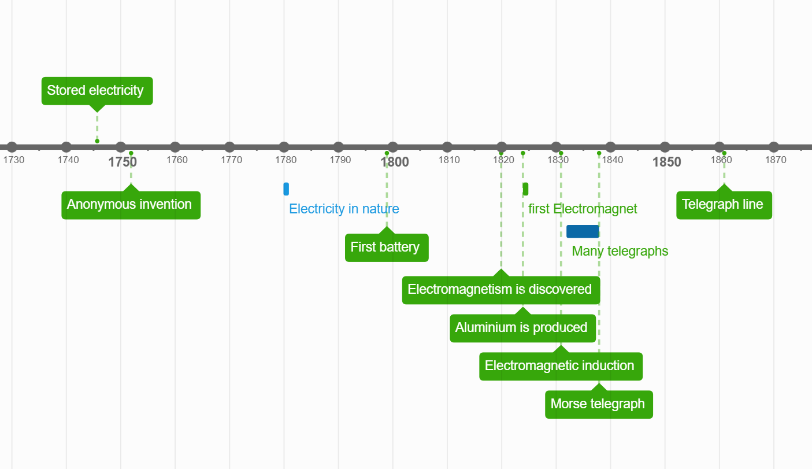

# The Telegraph 
## Introduction
Long distance communication has always been deep in the interest of human civilisation. Whether that was through smoke signals by the Native Americans, drums by African tribes, courier runners like in Ancient Greece, or sending domesticated pigeons like the Romans did, humans have always shown interest in being able to quickly send messages over a long distance within a short period of time. 
The invention of the telegraph system allowed us to send messages over a very long distance within a few seconds. It was also the first device to send messages via electricity. The telegraph is therefore an incredibly important invention in human history, and marks the beginning of long-distance communication through electricity.
## History 
Though interesting, the Chappe semaphore system, invented in 1791, was mechanical and visually based — less relevant for the electrical context.

The invention of the electric telegraph was allowed due to the increasing amount of scientific discoveries that were being made at the time - especially in the field of electricity and electromagnetism. In 1800 Alessandro Volta of Italy invented the Voltaic cell (Redox Reactions that generate current) which marked the beginning of small batteries. Up to that point, electricity was only known as stored electric outburst like in animals or when rubbing amber with a cloth, for example. Volta's invention created a steady current and supply of electricity, which was perfect for devices that needed a steady power supply - which is most devices. 

What followed was many more inventions in the field of electricity, electric circuits, magnetism and electromagnetism. Some of these include electromagnetic induction: If you rub a wire with a magnet it will create an electric current. Electromagnetism: Electric current creates a magnetic field, so if you wrap some wire around an iron nail and turn it on, the iron nail will turn into a magnet that can be turned on or off. 
Between 1832 and 1837 many different types of telegraphs were created. Below are some famous examples:
- 1832 - Pavel Schilling, a Russian diplomat, built an electromagnetic telegraph using a wire for each letter    
- 1833 - Carl F. Gauss and Wilhelm Weber of Germany invented an electric telegraph with a needle that points to a letter  
- 1835 - Joseph Henry, an American inventor, invented a relay station to boost electric current  
- 1836 - Edward Davy invented a better relay switch in the UK  
- 1837 - Cooke and Wheatstone of the UK invented a better telegraph with 5 needles pointing to a letter  
- 1837 - Samuel Morse invents the sound based encoding system "Morse Code" and uses it in his own telegraph   

All of these shared the same idea: send a text message over a long distance in a short time using electricity or magnetism. The big problem everyone was facing though, was how to convey electric signals into actual letters and numbers. So inventions called for as many different wires as symbols your alphabet contains, a board with 5 points that point to the letter you want to send, depending on the strength of the signal, a pointer that points to your letter on a clock-like board, and many more. 1837 Samuel Morse independantly invented the telegraph and used a system that no one else has thought of yet: sound! His invention used an electromagnet that would pull a piece of metal to produce a click or a ding sound, and different combinations of these clicks would refer to different letters, numbers or symbols. Morse's telegraph used only a single wire. The length of each button press determined the signal: short taps for dots, longer presses for dashes. By the 1840s, due to its simplicity, the Morse telegraph became the most widespread. 

## How it works
In this project, to learn more about how the telegraph works, we will be looking at the most wide-spread and famous type of telegraph - The Morse telegraph. That's the one with the sounds and the morse code, also sometimes shown as printed dots and dashes where dots are short pauses between clicks and dashes are long pauses. We will later look at this system. This is the same telegraph often depicted in movies or comics - such as the Lucky Luke comic series.

The Morse telegraph is quite simple - It is basically a circuit with a button and once the button gets pressed the circuit closes and a sounder is activated making a clicking noise. The longer the button is closed the longer the pause between the clicks sound lasts. It's as simple as that! Below is a circuit schematic showing the sending and receiving stations respectively. This is the first step of the morse telegraph - but we aren't quite there yet. In this schematic, City A has the "telegraph key", which is the button, and City B has the "telegraph sounder", which is the sounder indicating a message. We have to imagine that the cable connecting City A and City B isn't just a couple of meters, but many kilometers even. The first commercial telegraph was sent from Washington D.C. to Baltimore which is a distance of almost 70km or just above 40 miles. Now you probably have realised something - it isn't a closed circuit. And you are right! There is only one cable connecting the two, so where is the return cable? Well, our planet is the return cable. Basically, if both sides just tie their respective grounds to a metre long conducting rod (like a steel rod) and shove it in the ground outside their stations, the earth will act as the return cable. Though it is important to note that that only worked in moist regions with soil. In dry and sandy or rocky places they would have to build specific saltwater pits to allow conductivity. Like that we are saving a lot of money and material on a return cable. Another thing you might have noticed is, that messages can only be sent from City A to City B. To allow messages to be sent in both directions, each station has its own telegraph key and sounder. When City A presses its key, City B hears a click, and vice versa. The same wire is used for both directions, and each station has its own battery to power outgoing signals. They don't even need a switch since the key is a button which is generally off anyway, so the current is forced through the sounding part. 

## Technical
Of course a telegraph, like pretty much everything else on this planet, comes with some kind of numbers or formulas. Some questions might have arisen by now already, for example "Is there a maximum length?" or "Does the thickness of the wire play a role?". These questions can be answered by some simple physics in the field of electrostatics. 

As we read in the previous "How it works" chapter, we know that an electrical pulse for the code is sent as soon as the key is pressed downwards. The battery connected basically now has a road without distruptions towards the Ground, even though the ground is located many miles away. The voltage of the battery does in fact make a difference, and we will see why now. For a distance of 5km, a 3-5V battery will do just fine, however a 100V battery is complete overkill. On the other hand, for a distance of 2000km, a battery of 3-5V is not nearly enough, even a 100V battery is somewhat weak. 

We will start with the basics. In a simple circuit consisting of a battery, a wire and a consumer, we have the simple formula of Ohm's Law:    
\[
U = R \cdot I
\]   
where $U$ is the voltage supplied by the battery, $R$ is the resistance of the consumer and $I$ is the current flowing in the circuit. 
When the telegraph key is pressed down, the entire system is nothing more of a simple circuit with a battery, a button, wire, and a light bulb or a buzzer or some other mechanism on the other side that uses the electricity to signify a message. 
In small circuits, wire resistance is practically none, however over many kilometers, the wire adds a significant resistance to the circuit, which drops the voltage significantly over distance. We can calculate the resistance of the wire using this formula:  
\[
R_{\text{wire}} = 1.7 \cdot 10^{-8} \cdot \frac{20000}{\pi \cdot (0.0005)^2} = 432.9 \, \Omega
\]
 $\rho$ is the resistivity of the wire material (measured in ohm meters, in copper wires it is about $1.7 \cdot 10^{-8}  \Omega \cdot m $)  
$L$ is the length of the wire
$A$ is the cross-sectional area of the wire in $m^2$
Let us visualise this with an exampel. City A wants to communicate with City B using a telegraph. City B has a sounder that needs a minimum of 3V to operate. Historically, a sounder needed between 20 and 50mA to operate aswell. So we will go with 25mA. The two cities are seperated by 20km and the telegraph runs with a copper wire with a 1mm diameter. To calculate the ideal voltage the battery should have at City A, lets first calculate the voltage drop (aka the lost voltage due to wire restistance) over this distance.  
To calculate $R_{wire}$, we can simply plug in all our values into the formula given above. $R_{wire} = 1.7 \cdot 10^{-8} \cdot \frac{20000m}{\pi \cdot 0.0005^2m^2}$ 
Calculating this gives us a total resistance of $432.9 \Omega$ . 
Now we can calculate the voltage drop using ohm's law. $U_{drop} = 432.9 \Omega \cdot 0.025A$ which equals to $10.8V$. So over this distance, the cable will result in the sounder (City B) recieving 10.8 Volts less than what the battery in City A supplies. Knowing that the sounder needs atleast 3V to activate, we can just add that to the voltage drop and figure out the minimum voltage our battery in City A needs to supply. $10.8 + 3 = 13.8$ V . Of course there's also some other natural phenomena like ground resistance, the connections of the wires having resistance, etc... So using the bare minimum of 13.8V probably still won't work realistically, since these formula all assume ideal conditions. Using two 9V batteries in series, equaling 18V in total, should do the trick in this example setup. 
Since we want $R_{wire}$ to be as small as possible, we can adjust certain things in our telegraph system as well. We can't change the resistivity constant, but we could use something with an even smaller resistance like Silver with a resistivity of $\rho = 1.6\cdot 10^{-8}$ (see below for a table with more materials and their respective resistivity at 20°C). 
Yep, that is the only one. And since it's so much more expensive, and only slightly better than copper, we will just stick with copper. We could also decrease the length, but that's not possible, since the two cities are at a fixed distance from eachother. That leaves us with the cross sectional area of the wire. By using a thicker wire, we can decrease the wire resistance. In telegraphs spanning over hundreds of kilometers, the people would use wires with a radius of 2.5mm to 4mm. A wire with 3mm radius has 9 times less resistance than a wire with 1mm radius, since the resistance is proportional to the square of the radius. 
Now we come to a new problem. It comes to a point where you can't increase the voltage, or simply can't increase the wire thickness for some reason. If only we could prevent the voltage drop somewhere along the wire or completely reset the electrical signal, huh? Well lucky for us there is in fact an electrical component that does just that. It's called a "Relay" or "Relay switch" and basically acts like an electrically activated button, that, when electric current flows through it, activates an electromagnet that pulls a metal object to it, closing a new circuit with an entirely new battery basically reseting the circuit again. Kind of like a minecraft redstone repeater, it extends the signal strength and resets the lost voltage due to resistance. A relay basically turns one telegraph circuit into multiple smaller ones, each with a new but equal voltage source.
To calculate how many relays we need to place along the telegraph line, we have this handy formula:
\[
N_{\text{of relays}} = \lceil\frac{\text{Total distance}}{\text{Max working distance}}\rceil -1
\]
Total distance is the length between City A and City B and Max working distance is the maximal distance the battery voltage can supply before losing so much voltage due to wire resistivity that it can't power anything anymore. 
The max working distance \( L_{\text{max}} \) is given by:
\[
L_{\text{max}} = \frac{(U_{\text{source}} - U_{\text{min}}) \cdot A}{\rho \cdot I}
\]
where 
\[
A = \pi r^2
\]
and $U_{min}$ is the minimum require voltage the sounder in City B requires. 

Lets look at these two formulas with the example from above. These are the given values from before:
$r_{wire} = 1\text{mm}$
$L_{wire} = 20\text{km}$
$U_{min} = 3\text{V}$
$I = 0.025 \text{A}$
we will give City A just a 5V battery to work with. The wire is made of copper, to keep it realistic.
With a simple calculation of the voltage drop from a formula mentioned further up:
$R_{wire} = \rho \cdot \frac{L_{total}}{\pi r_{wire}^2}$
$R_{wire} = 1.7\cdot 10^{-8} \cdot \frac{20000\text{m}}{\pi 0.0005^2} = 432.9 \Omega$ 
$ U_{drop} = R \cdot I$ 
$U_{drop} = 432.9 \Omega \cdot 0.025 \text{A} = 10.6\text{V}$
We will lose 10.6V of our original 5V, which of course means we will completely lose all of our voltage and the sounder in City B will not work. This telegraph system definitely needs some relay stations. Each relay will be fitted with the same battery as the original, so 5V. 
Lets calculate how many relays we need and every how many kilometers we need to place one. We will use this formula: 
\[
L_{max} = \frac{(U_{relay} - U_{min})\cdot A_{wire}}{\rho \cdot I}
\]
\[
L_{max}=\frac{(5\text{V}-3\text{V})\cdot \pi \cdot 0.0005^2}{1.7\cdot 10^{-8}\cdot 0.025 \text{A}} = 3695.99 \text{m} = 3.7\text{km}  
\]
We need to place a relay station every 3.7km to ensure that the sounder in city B gets activated. It won't work out exactly, possibly placing a relays closer to city B towards the end due to 20km not being perfecty divisible by 3.7, but that's ok. Ideally we want even more voltage in city B, since this formula gave us the minimum theoretical distance under ideal conditions and we even rounded up a little.

## The transatlantic cable
in 1858 a telegraph cable was laid under the Atlantic Ocean connecting Valentia Island near Ireland with Newfoundland in Canada. The cable consisted of a copper wire 1.4mm in diameter covered in an insulation of gutta-percha, a type of rubber, and that was then surrounded by a thick layer of steel wire armour to protect it from the seabed. It weighted 2.5 tons per kilometer and was about 4'000km long. The cable was carried on coils upon two different ships due to the size and weight, and was rolled out using these along the Telegraph Plateau, a flat part of the Ocean designated ideal for cable-laying by oceanographers. The telegraph was run on relatively high voltage, but not too much was necessary, since the cable was quite thick. It didn't have relay stations and failed often due to corrosion and signal degradation. However it is considered a marvel of engineering for humans. The one laid in 1858 failed miserably multiple times, as mentioned earlier, and even snapped due to over-stretching. In 1866 the best version of the transatlantic telegraph cable was finished and could reliably send messages in a matter of minutes. Though it also underwent certain problems, it worked incredibly well. 