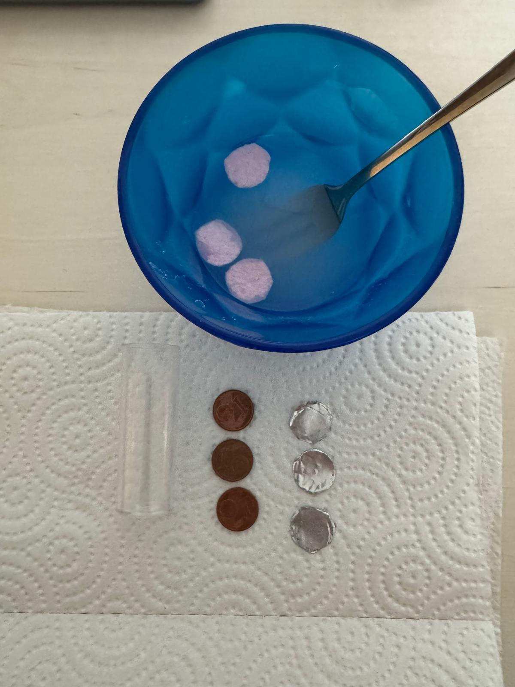
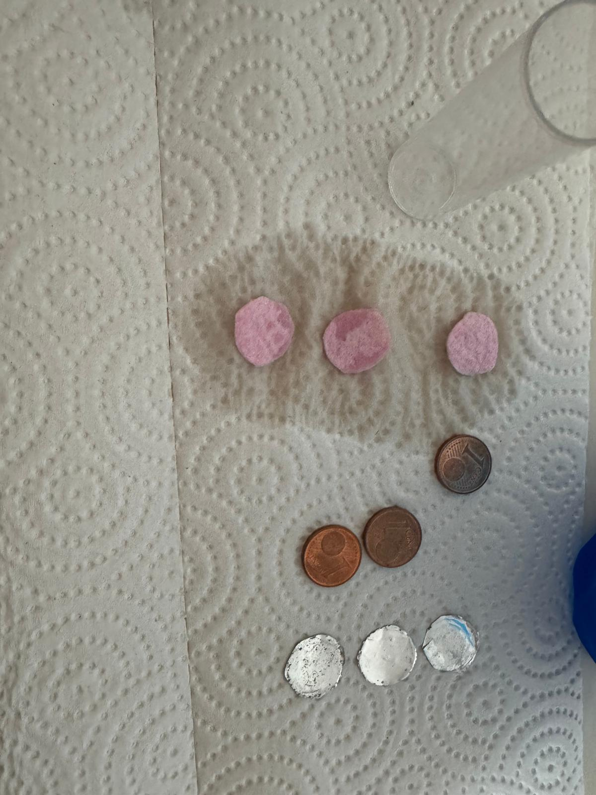
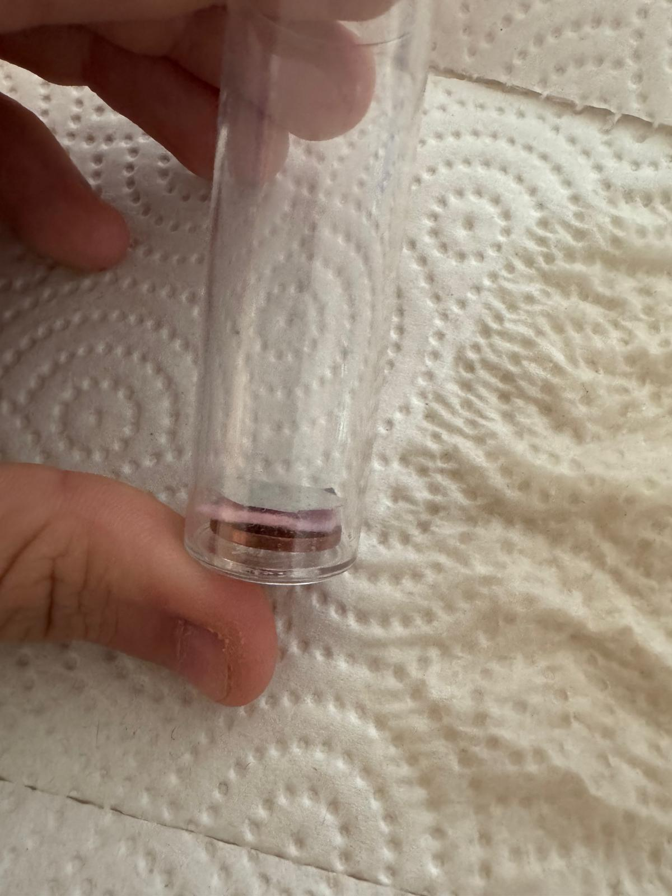
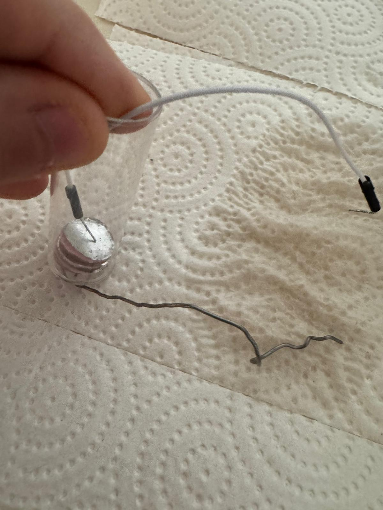
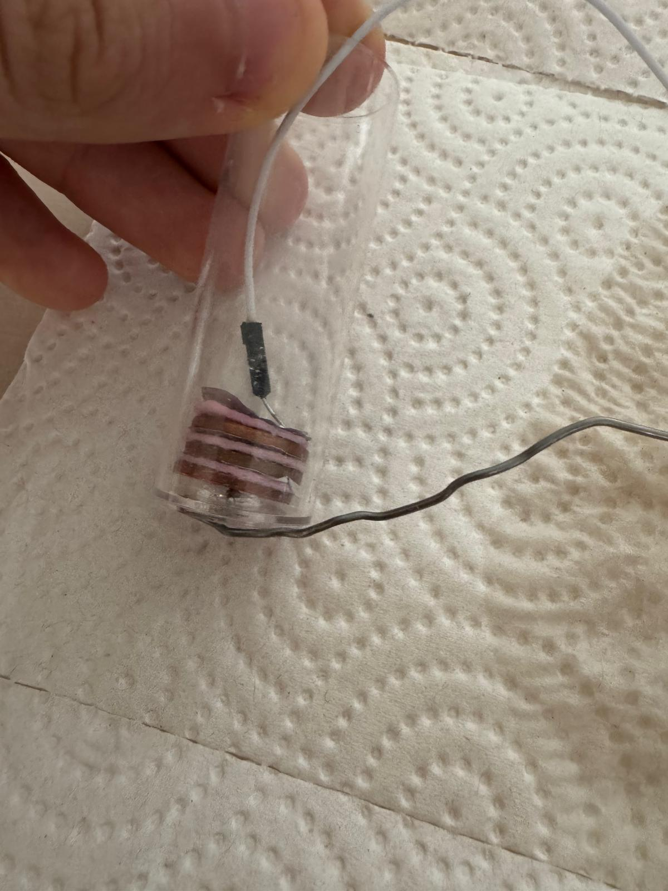
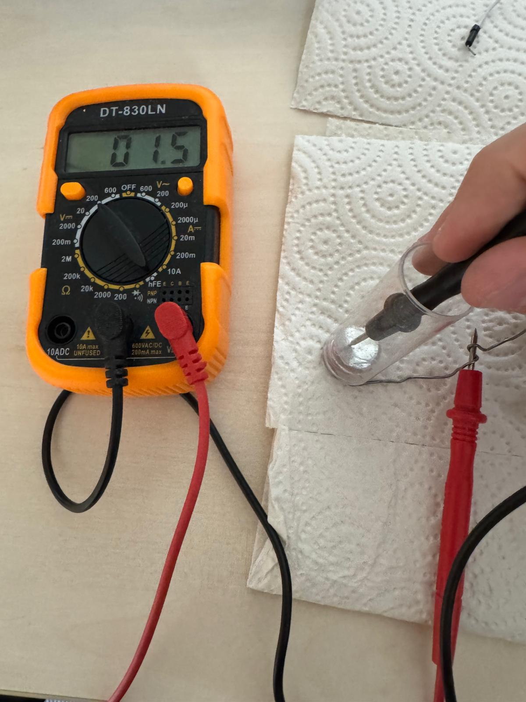

# The components
This short chapter aims to show you what components were used in the telegraph and how they work independent from the telegraph. 

## The battery
The battery was invented by Alessandro Volta from Italy in 1800. His invention was called "the Voltaic pile" and we will see why now. 
To understand how every battery works some chemistry is required. In this sub-chapter we will build our own Voltaic pile (first ever working battery) and learn why it works.

#### What you need:
- equally as many copper plates and aluminium or zinc plates. For the copper I used 1 Cent coins and for the Aluminium I used aluminium foil cut into circles the same size as the 1 Cent coins.
- Paper or Felt circles (same size as the coins and foil again). I used felt. 
- Some Water with a teaspoon of Salt in a small cup
- Optional: A plastic tube to keep everything in place

#### Instructions:
First, dip the paper or felt circles into the cup of salt water until they are completely wet. Then lay them out on a paper towl to dry for a bit. They don't need to be dry completely, just let them be for a minute or two until they are only slightly moist. 
Place all the stuff in the following order: Copper, felt, aluminium. And repeat until you place your final aluminium or zinc item on top. You should have a "pile" of copper, felt or paper, and aluminium or zinc, in repeating order. 
Now you can take a multimetre and measure the voltage across the battery. I made 3 piles, so I did the order of copper-felt-aluminium 3 times and with that I measured a voltage of about 1.5 Volts.
There we go, we built a battery just like Alessandro Volta did over 200 years ago! 

Each cell produced around 0.5V for me and in series you can just multiply this. I stacked 3 of these cells on top of eachother and when I measured the final voltage I reached a value of approximately 1.5V. This is by far not enough to power a multiple kilometre long telegraph but stacking many of these on top of eachother then it would work perfectly.
Due to the chemical reaction a layer of oxidized metal would form on the Copper and one day the battery would stop working because the copper coin is covered by a non-conductive layer. 
Also, the current is extremely weak within this battery, you would have to charge up a suitable capacitor to get a usable current. It has a low current because the material in the voltaic cell have very high internal resistance.
 Image 1: Preparing the felt in salt water.

 Image 2: All material lain out.

 Image 3: Put Copper coin, then salt-water-felt, then aluminium foil in a plastic tube. The tube has a small hole on the bottom. 

 Image 4: Inserted a conductive cable into the plastic tube's bottom hole so that it touches the bottom Copper coin. Added another 2 voltaic piles. 

 Image 5: Added a second cable through the top opening of the plastic cylinder. This cable must touch the top aluminium foil. 

 Image 6: Full setup of what we have now. 3 Voltaic piles piled above eachother in a plastic cylinder connected by cables on both sides - just like a battery!

 Image 7: Measured the voltage across the battery by connecting a Multimetre to the two cables. The final voltage was about 1.5V. 

