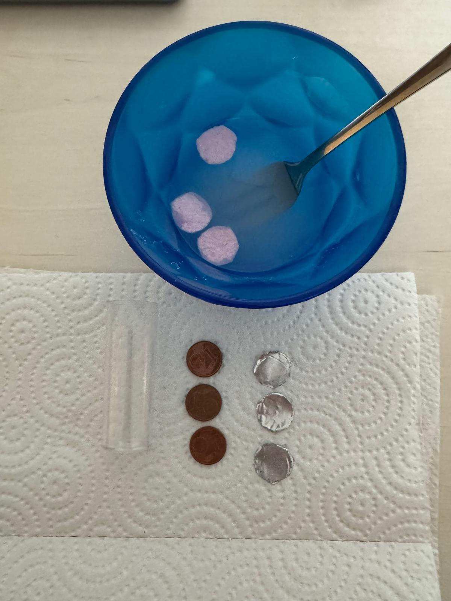
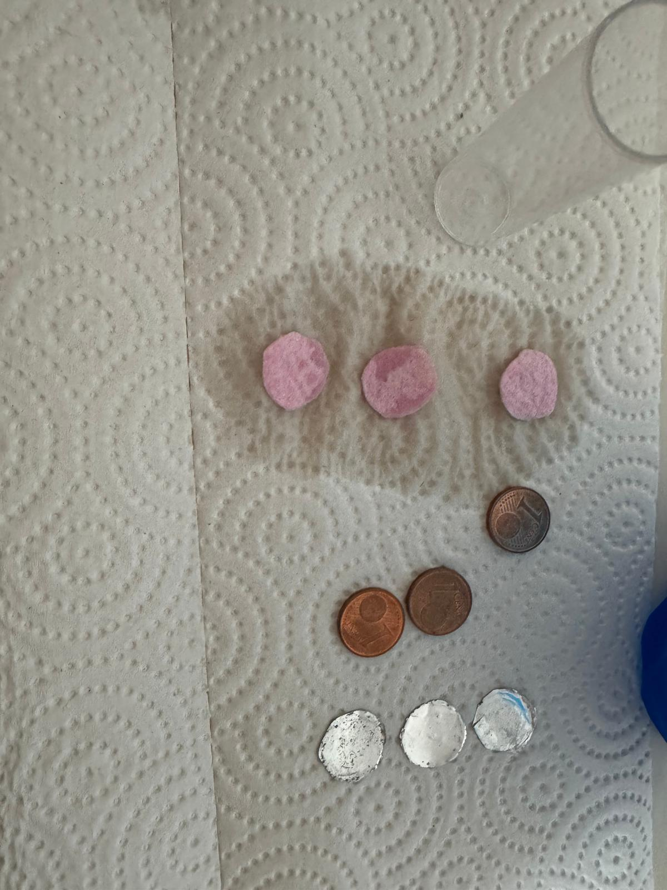
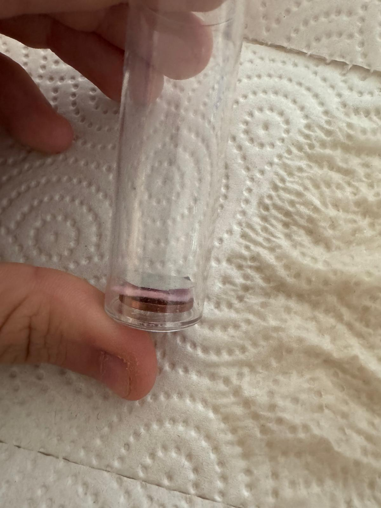
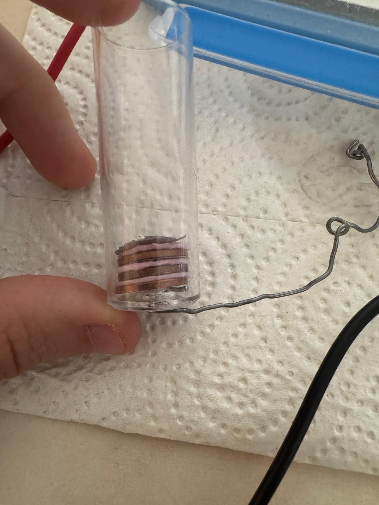
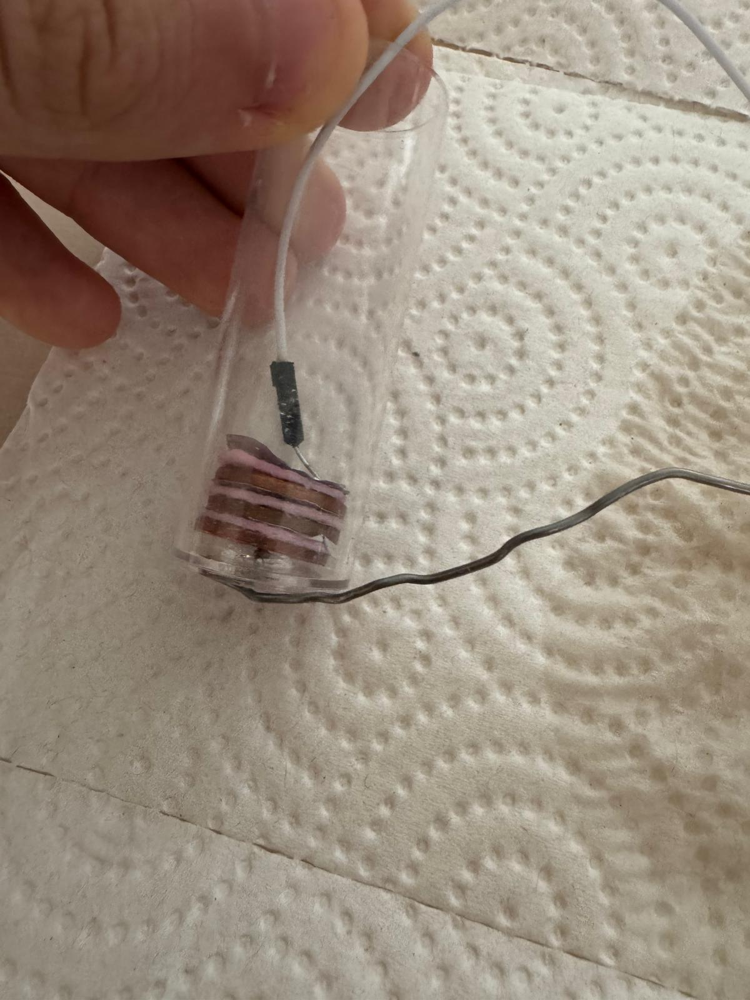
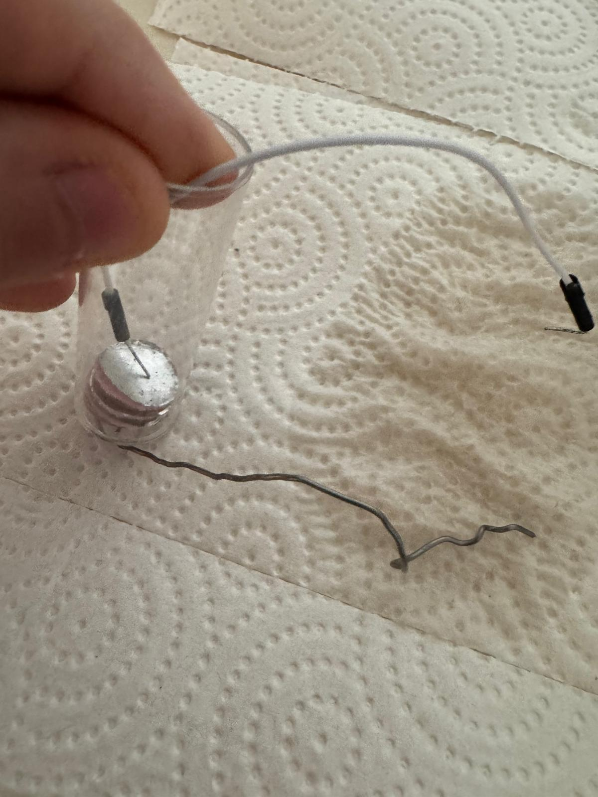
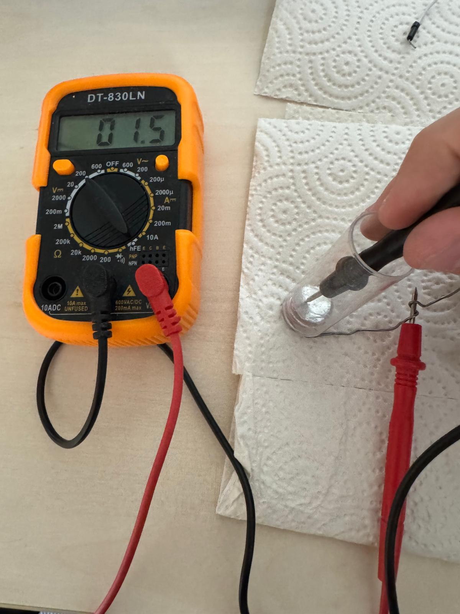

# **The components**
This short chapter aims to show you what components were used in the telegraph and how they work independent from the telegraph. 

## The battery
The battery was invented by Alessandro Volta from Italy in 1800. His invention was called "The Voltaic pile". 

### What you need:
- equally as many copper plates and aluminium or zinc plates. For the copper I used 1 Cent coins and for the Aluminium I used aluminium foil cut into circles the same size as the 1 Cent coins.
- Paper or Felt circles (same size as the coins and foil again). I used felt. 
- Some Water with a teaspoon of Salt in a small cup
- 2 cables
- Optional: A plastic tube to keep everything in place

### Instructions:
#### Step 1
 

Dip the felt in salt water until they are covered. 

#### Step 2
 

Lay out all the material and quickly let the felt dry for a minute or two. They don't have to dry completely, keep them slightly moist.

#### Step 3
 

Stack the material in the following order: Copper, felt, aluminium. I used a plastic tube with holes on both sides as an aid. 

#### Step 4
 

Add more of these piles above eachother. Do not seperate them, just add the copper right on top of the last aluminium and continue. Also, connect the first copper with a cable or any other conductive material. I just used a bit of solder.  

#### Step 5

Connect the last aluminium with a cable too. This time I used a proper cable.

#### Step 6

After following the previous steps you should have something that looks like this. Now you have a working battery and can connect the two cable to whatever you want, as if it were a real battery. The copper side is the positive and the aluminium side is the negative. 

#### Step 7
 

Now we can measure the voltage in our battery. We had 3 piles and the multimetre shows us a value of 1.5V across the entire battery. Therefore one of our piles gives us around 0.5 Volts. Though, this battery probably won't work in a circuit, since it has a very big internal resistance (the coins and the felt) which means it will have a very low current. 
(In the formula $ V=R\cdot I$ 
if $R$ is very large then $I$ must be very small to keep the $V$ constant in the closed system)
There we go, we have just built a battery just like Alessandro Volta did over 200 years ago! 

## The Electromagnet
The elctromagnet was invented by William Sturgeon in 1824. It follows Oersted's Law, which basically says: "When current flows through a cable, a magnetic field is generated". 
We can make that field stronger if we wrap the cable into a coil. An electromagnet is great, because it's basically a magnet you can turn on and off again with just electricity. In our telegraph we use an electromagnet to attract a piece of metal (in our case a screw) to make a sound and then release it again when we don't want any sound. An electromagnet works fine with just air in the center, but it works best if we use a ferromagnetic (material that is magnetic) core and wrap the cable around it. Which is why we used a long iron screw. Let's learn how to build one, but first, the formula. 
The magnetic field strength, aka. how strong the electromagnet is, is determined by the following formulas:

Around a straight, current carrying conductor:
$ B = \frac{\mu_0 \mu_r I}{2\pi r} $

In the centre of a current carrying loop:
$ B = \frac{\mu_0 \mu_r I}{2r} $

In the centre of a current carrying coil
$ B = \mu_0\mu_r\frac{NI}{\sqrt{l^2+4r^2}} $

Where:
$B$ is the magnetic strength measured in Teslas
$\mu_0$ is the permeability of vacuum and is $4\pi \cdot 10^{-7} \frac{Tm}{A} $
$\mu_r$ is the relative permeability of the space around the cable. For air it is 1.
$I$ is the current flowing through the wire
$r$ is the radius of the electromagnet with the wire
$N$ is the number of turns you have done with the cable around the core
$l$ is the length of the wire around the core

A coil will deliver the strongest magnet, whereas the magnetic strength of a cable is barely noticeable. 
To build an electromagnet, all you need is a long iron bolt or screw, some copper wire and a batter.
1. wrap the wire around the screw a couple of times. The wire must be covered in an insulation otherwise the electromagnet won't work! 
2. Take the start bit and end bit of the wire which is now wrapped around the screw and sandpaper or burn away the insulation at the ends. 
3. Connect the two ends to the battery.
4. The moment you connect both ends to the battery (It doesn't matter which side is positive or negative) the electromagnet will be turned on.
5. Hover it above some metal objects like paperclips, screws or other things. You will notice the electromagnet will have an effect.
6. To increase the power, you can:
   1. Use a stronger battery
   2. Take a longer wire and make more turns around the core

If your electromagnet doesn't work, check if the two ends are open and that current flows through your contraption (multimetre). Also check if your battery isn't empty or just use a stronger one. 

There we go, we just built a super simple electromagnet!

