# How to build a telegraph
## Materials
- All 3d printed parts from the folder
- 2 equally long cables
- a lot of insulate copper wire
- 8 neodymium magnets 6x3mm
- a battery
- a way of connecting the battery to the circuit
- 2 M3.5 40mm bolts
- 1 M3.5 16mm bolt
- 4 nails (for the reciever)
- 13 conductive screws
- 2 wooden planks as a bottom
- 2 some kind of stick or wire, max 2mm thick, for the hinges
- 4 nuts for the bolts
  
- hot glue
- solder and a soldering station
- a lighter
- hammer
- screwdriver for the screws

## Instructions 0: How to prepare insulated wire:
1. The insulated copper wire cannot conduct like this, as it has a plastic layer around it. This is very good for building electromagnets, but we still need to make a connection. Take the end bit of the insulated copper wire and hold a lighter underneath it for a couple of seconds. It will burn away the plastic layer. 
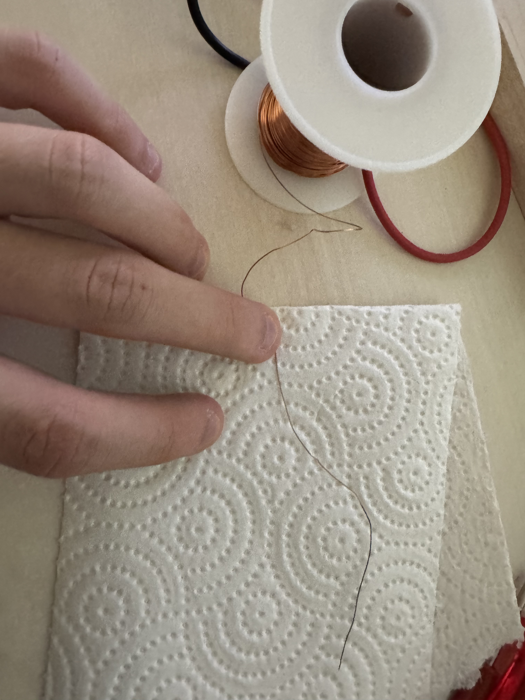

As you can see on the photos, the black part is the burnt wire. Since this part now has no more plastic sheating, this will conduct electricity. 

## Instructions 1: The Telegraph Key
1. Take the printed sender and 2 neodymium magnets stuck together. Put the tow magnets into the hole shown in the photo.
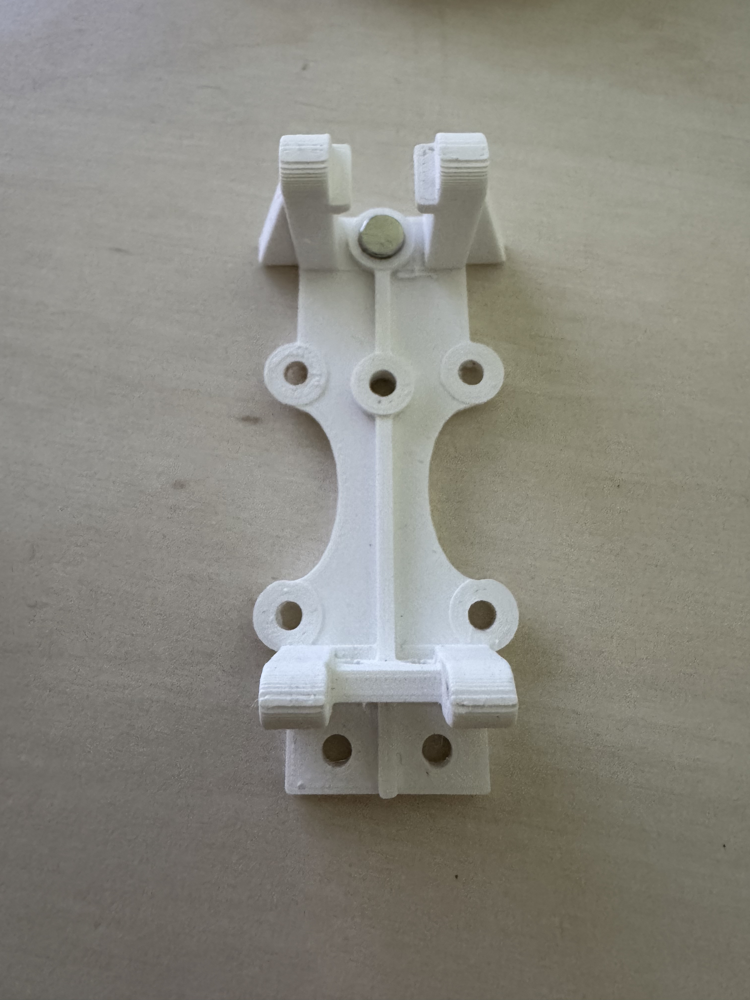 
2. Take your sender part and place it on a wooden board. Draw the outline.
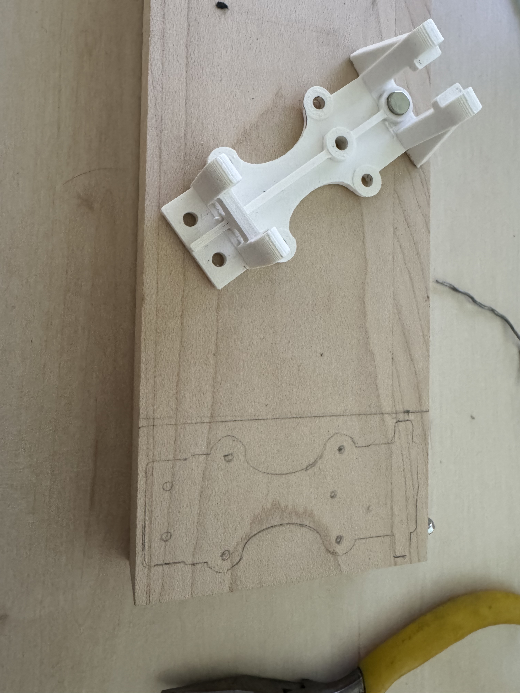
3. Screw a conductive screw into the center hole. Don't screw it in entirely.
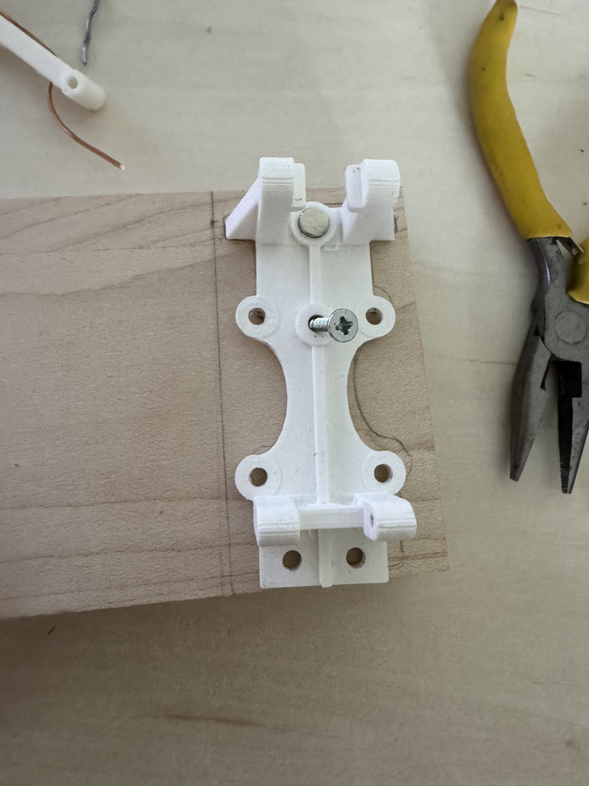
4. Prepare the insulated wire by following the steps above in the subchapter "Preparing insulated wire". Wrap the revealed end of the wire around the half-screwed-in screw. Make sure you have a connection between the revealed wire and the entire screw. 
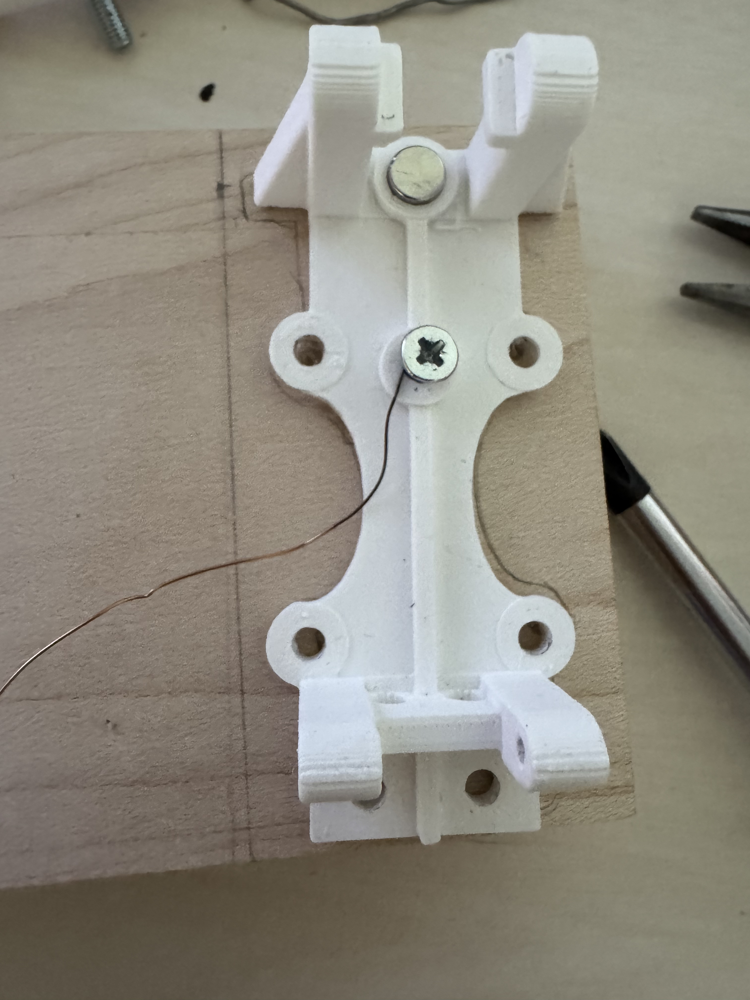
5. Cut off the wire from the whole coil and feed it through the hole shown. Screw in the screw almost completely. 
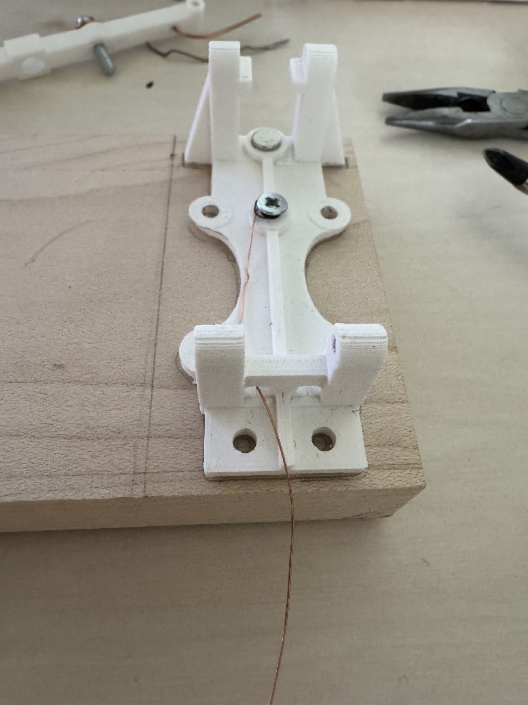
6. Take the top part of the key (the button you press) and put a M3.5 16mm bolt through the hole. Connect a bit of insulated copper wire around this bolt just like around the screw in the previous steps. Don't forget to prepare the wire first. It isn't visible in the first image, but as you can see in the second image I later put nuts on boths sides of the bolt to keep it in place. I would recommend this.
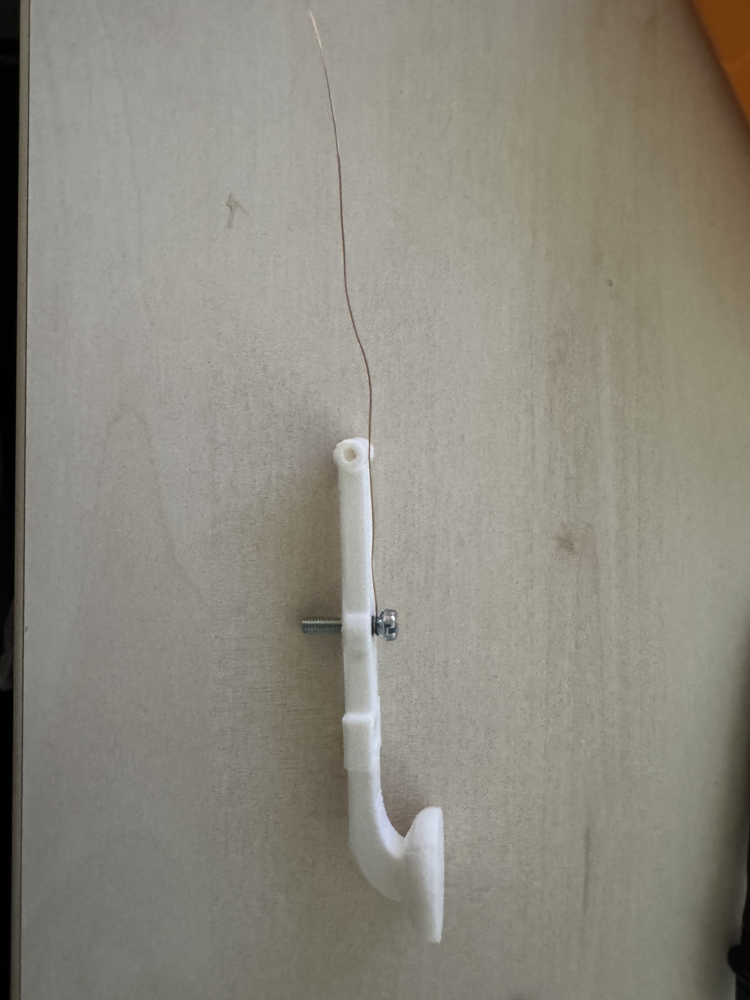 
7. Thread that wire through the hole shown.
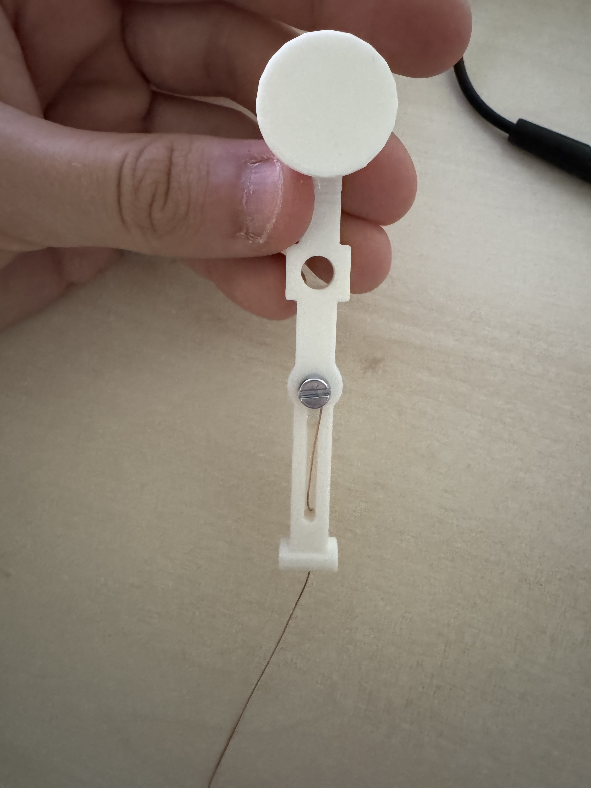
8. Insert two connected neodymium magnets into the top parts' respective hole as shown. 
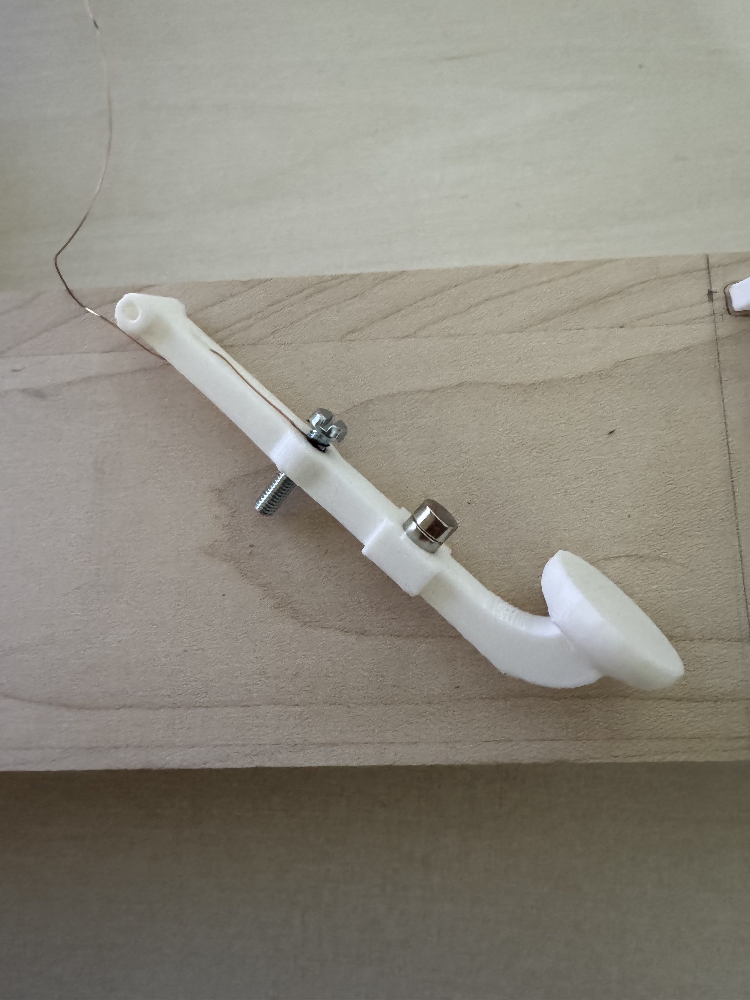
9. Put the top part onto the base and thread a hinge through the cylinder shaped hole in the back. I used solder because I had nothing else around. Make sure that the top button is repelled upwards due to the magnets. If it get pulled downwards you have inserted the magnets the wrong way. Just take them out of the top one and switch them around. The arm must get pressed upwards. 
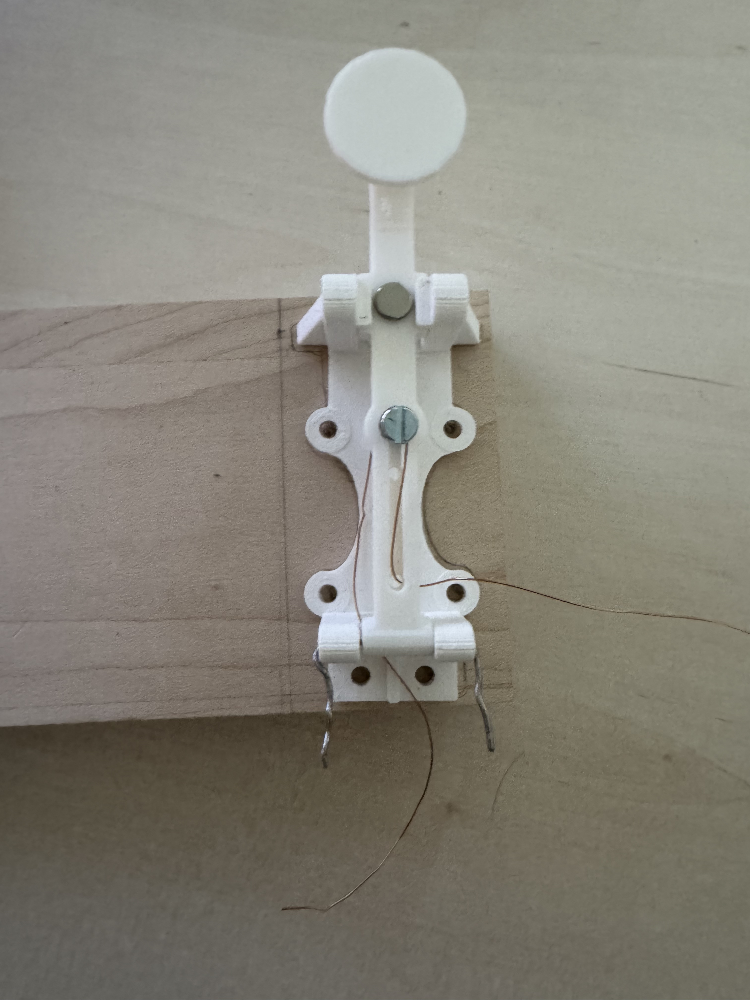
10. Thread the copper wire from the top part through the hole of the base. These images were taken before I had the idea to use nuts instead of glue. Just beware that the top bolt now should have nuts on both sides, and NOT hot glue like the image shows.
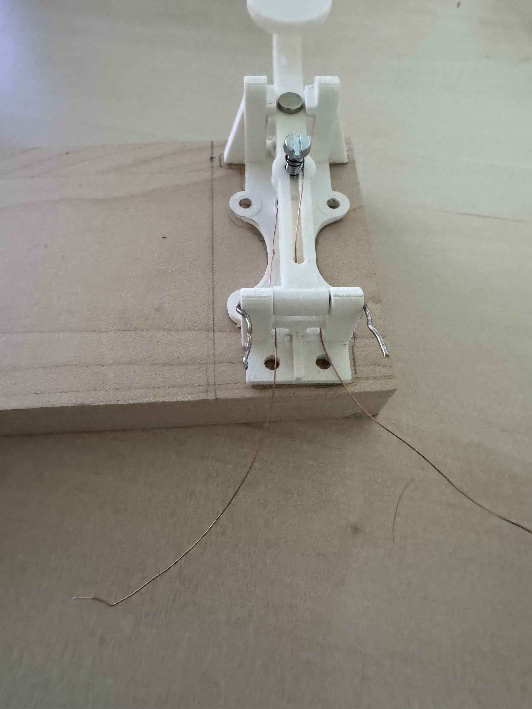
Here are better images. The bottom bit of the top bolt SHOULDN'T touch the top bit of the bottom screw. Since glue was too weak I replaced it with two nuts instead.
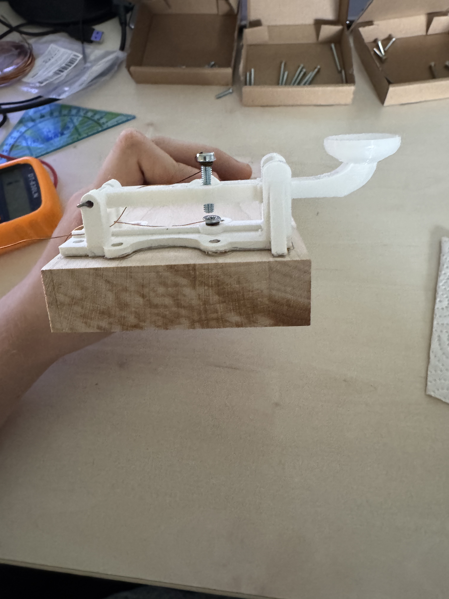 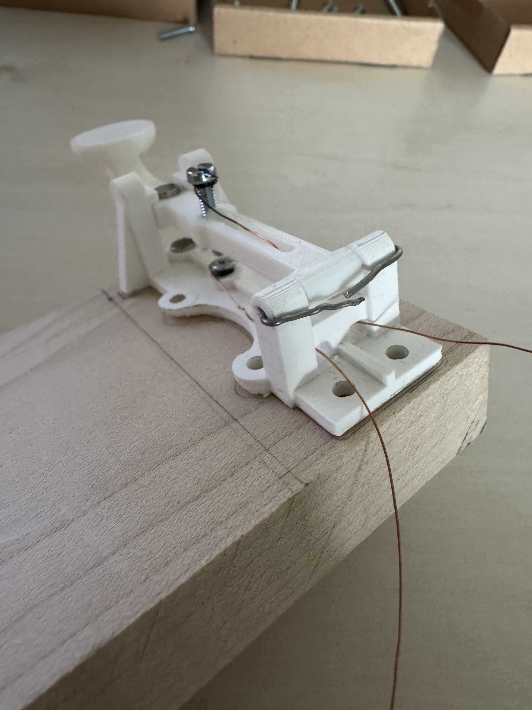
11. Screw in screws in the 4 holes on the sides and two in the back. The 4 on the side you can screw in entirely, but screw the back two only about halfway in. (I messed up on one and used a golden nail just ignore that and pretend there's a screw there) I also replaced the thin solder hinge with a thicker copper wire. 

12. Prepare the two exposed copper wires (the other ends now) and wrap them around the screws to their respective holes. Make sure there is a connection between the wire and the screw it's wrapped around.
Take whatever positive cable will be connected to the positive side of the power source (battery) and wrap that around the screw on the right aswell. Screw in the right screw completely. We will still need the left one later so leave that one half-screwed.
 

## Instructions 2: The Telegraph Sounder
1. Take the big part depicted in the image. This is the top part of the sounder. Then we insert a long bolt, the M3.5 20mm one, into the front hole. 

2. Take that little circle with the rectangle on the side and screw it on to the bottom of the long bolt. Turn the circle so that the rectangle with the 2 holes faces towards the larger part inside.

3. This bolt will be the core of the electromagnet. Wrap the insulated copper wire about 1000 (yes, a thousand) times around the iron core. It doesn't matter if you overlap, as long as it always goes in the same direction. 

4. Take that plastic screw and insert two neodymium magnets. 
 
5. Take the small arm like thing and insert two magnets into there aswell. 

It is important that the magnets REPEL eachother when put into this position:

6. Take that plastic screw with the magnets and screw it into that big hole of the top sounder part. 
 
7. Take that arm and put a bolt through it facing downwards like in the image. I first used a M3.5 20mm but then I replaced it with a M3.5 40mm and put nuts on each side - just like I did with the telegraph key. As a hinge do it the same way as with the key - solder or copper wire or a 2mm thick stick.
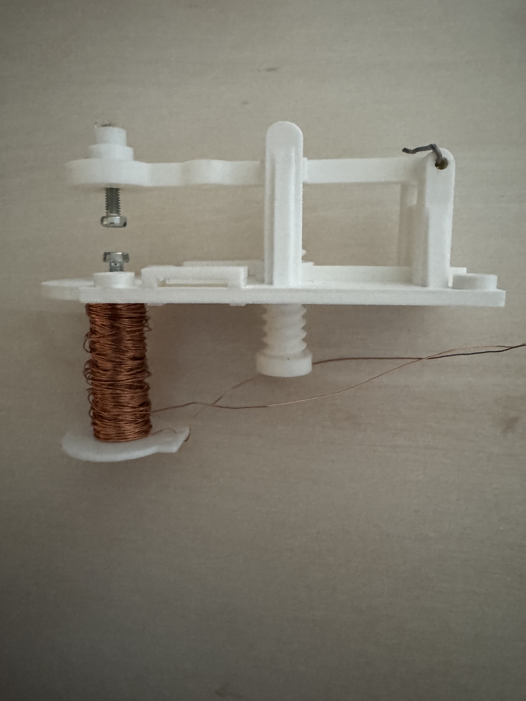
8. Now assemble the two sounder parts. Take the bottom part and 4 nails that fit approximately into the 4 holes. (The nails I used were a bit longer than the hole) 

9. Insert the nails and then hot glue it all together.

10. Take the two wires that make up the electromagnet and feed them through the holes on the other side. It doesn't matter which wire goes which. 

11. Now do the same as with the telegraph key on a piece of wood. Screw 4 scres on the side holes right through. Screw 2 screws halfway through on the back ones, prepare the two copper wires and wrap them around. 

12. Take one of the two cables and wrap that around on of the screws. Solder it together and make sure there's a conenction. 
  
13. Do the same with the other cable on the other screw. I then put tape over both afterwards, but I removed it later so you don't have to do this.
 
14. Connect one of the cable from the sounder (I used the black one because it will represent the ground) and connect it to the Negative of the battery. I covered it up with an insulator to cover up the solder. 

15. Now lastly, take the other wire and connect that from the sounder directly to the other open screw of the key.
 

This is the end of the instructions of building a telegraph. When you press down on the button of the telegraph key, the arm of the sounder should be pulled down and make a "click" sound and upon release of the key button it should go back to its original position.
If that isn't the case, adjust that plastic screw with the magnets in it. This is purposefully done incase the strength of the magnet differs. The arm should be like on the verge of falling down but just barely doesn't because that plastic screw's magnets pushes it up. Now the magnetic field is just barely enough to push it up, so upon activating the elctromagnet we create a stronger magnetic field there - hence forcefully pulling it downwards.
Incase it still won't work, check all the connections.