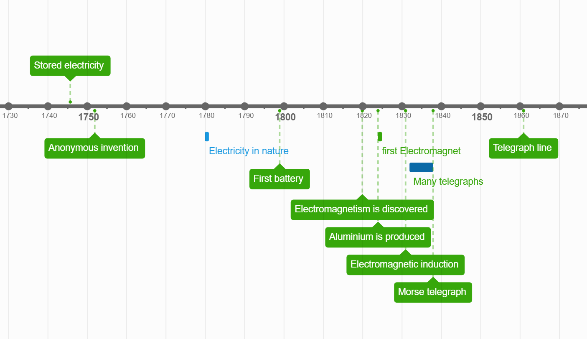

# The Telegraph 
## Introduction
Long distance communication has always been deep  in the interest of human civilisation. Whether that was through smoke signals by the Native Americans, drums by African tribes, courier runners like in Ancient Greece, or sending domesticated pigeons like the Romans did, humans have always shown interest in being able to quickly send messages over a long distance within a short period of time. 
The invention of the telegraph system allowed us to send messages over a very long distance within a few seconds. It was also the first device to send messages via electricity. The telegraph is therefore an incredibly important invention in human history, and marks the beginning of long-distance communication through electricity.
## History 
Though interesting, the Chappe semaphore system, invented in 1791, was mechanical and visually based. This is not very relevant for the electrical telegraph though.

Due to the rise in inventions in the field of electricity and magnetism, the invention of the telegraph, a device that allows communication using these new inventions, was bound to happen. The battery, magnetism, induction, electromagnets, and some others are the reason for this invention. Beforehand people only knew electricity by rubbing cloth or as lightning - so short bursts of static electricity. 

Here a short timeline of important events in the history of the telegraph:
- 1832 - Pavel Schilling, a Russian diplomat, built an electromagnetic telegraph using a wire for each letter    
- 1833 - Carl F. Gauss and Wilhelm Weber of Germany invented an electric telegraph with a needle that points to a letter  
- 1835 - Joseph Henry, an American inventor, invented a relay station to boost electric current  
- 1836 - Edward Davy invented a better relay switch in the UK  
- 1837 - Cooke and Wheatstone of the UK invented a better telegraph with 5 needles pointing to a letter  
- 1837 - Samuel Morse invents the sound based encoding system "Morse Code" and uses it in his own telegraph   

The device itself was never a dificult thing to make, what made it challenging was figuring out a way of converting messages into electricity.
Some inventions used 26 wires for one line, others used 5 for binary representation.  
The Europeans were coming up with all sorts of funny ways until an American named Samuel Morse thought of a sound based system. An electromagnet would get activated on the recieving end and pull a metal piece to it, creating a "click" sound, when released, it would produce another "clack" sound. Morse's telegraph used only a single wire. The length of each button press determined the signal: short taps for dots, longer presses for dashes. By the 1840s, due to its simplicity, the Morse telegraph became the most widespread. With this the Morse code also became international standard.

## The transatlantic cable
In 1858 a telegraph cable was laid under the Atlantic Ocean connecting Valentia Island near Ireland with Newfoundland in Canada. The cable consisted of a copper wire 1.4mm in diameter covered in an insulation of gutta-percha, a type of rubber, and that was then surrounded by a thick layer of steel wire armour to protect it from the seabed. It weighted 2.5 tons per kilometer and was about 4'000km long. The cable was carried on coils upon two different ships due to the size and weight, and was rolled out using these along the Telegraph Plateau, a flat part of the Ocean designated ideal for cable-laying by oceanographers. The telegraph was run on relatively high voltage, but not too much was necessary, since the cable was quite thick. It didn't have relay stations and failed often due to corrosion and signal degradation. However it is considered a marvel of engineering for humans. 
