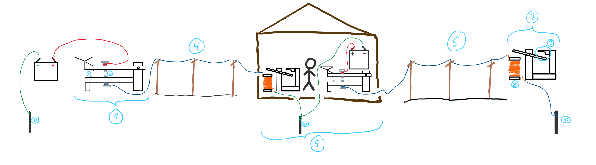

## How it works
In this project, to learn more about how the telegraph works, we will be looking at the most wide-spread and famous type of telegraph - The Morse telegraph. That's the one with the sounds and the morse code, also sometimes shown as printed dots and dashes where dots are short pauses between clicks and dashes are long pauses.

The Morse telegraph is quite simple - It is a closed circuit containing a power source, wires, a button and a sounder. 

Below is a drawing showing the sending and receiving stations respectively. 

On the left hand side we can see the Telegraph Key of City A (1). The telegraph key containes two repelling magnets (2) that seperate two conducting screws opposite eachother (3). When you press down on this lever, the two bolts connect with eachother for a brief moment. The moment you let go, the magnets repell again and the screws seperate again. In that time when pressed down, electrcitiy from the battery can travel through the cable connected to the top crew, through to the bottom screw and along the telegraph line (4) to a relay station (5). What the point of a relay station is will be explained later. There, the person working listens to the message sent, writes it down, and then sends it onward with a new telegraph key, therefore also a new battery. This same signal, just different battery, gets sent along the next line (6) to City B's Telegraph sounder (7). A telegraph sounder works as follows: The short current activates an electromagnet (8) which attracts a metal bar (9), that in turn slaps against another material and makes a "Click" sound. Once the electromagnet stops, so the signal is over, the bar is released and makes a "Clack" sound. This entire system is grounded, as all circuits should be. The ground isn't a return cable, however, as that would be too expensive. Every stations wraps their ground wires around a long metal rod (10) and shoves it in the ground (the modern equivalent of connecting ground to the kitchen sink for example). 
In this sketch, only City A can send messages and only City B can recieve messages. To make this line work both ways, each city, including the relay station in the middle, needs both a key and a sounder on each end. A switch will stop your sent message to arrive on you own sounder.

## Why do we need a relay station?
Over a long distance, the strength of electricity wears out. We speak of many hundred kilometres. Cables have resistance and we can easily calculate it in the next chapter. Because of this steady diminishing of voltage in the wire, it could be, that the reciever is so far away, that the voltage will have completely worn out by then, and the sounder will not activate. The elctromagnet needs a minimum amount of voltage and current to function, otherwise it will not. 
To combat this problem, people would put relay stations along the telegraph line. Relay stations are basically little huts somewhere along the line when the current starts to get weak, where a person would sit the entire day and listen for a message. After writing down the message, he would just send it onwards on the other side with a new telegraph system connected to either another relay station or City B. The message stays the same but now the current starts off fresh again.
In later years, this hut with a person in it was replaced by an automatic relay station called an electrical relay. But in the earlier days it was done completely manually by a paid person in a hut.
This is one of the reasons why a lot of telegraph lines were along train tracks; To give the people at relay stations, often in the middle of nowhere, a possibility of transport. Relay stations, or telegraph stations in general, were commonly placed in trainstations.
Relay stations were often placed every couple of kilometers (some 20-30km apart). 
