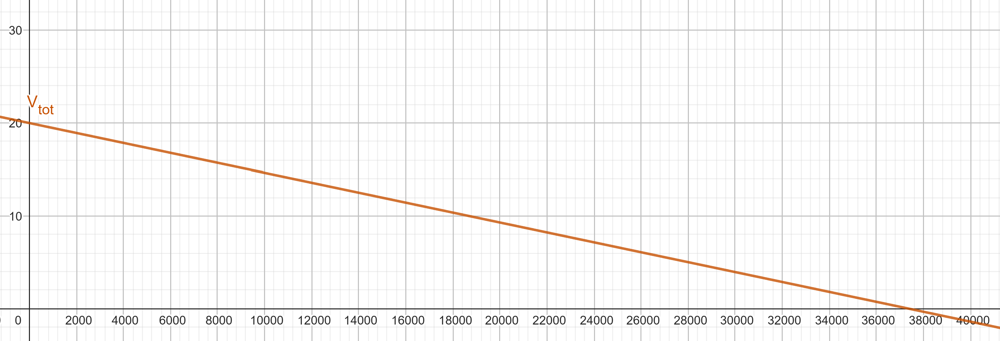
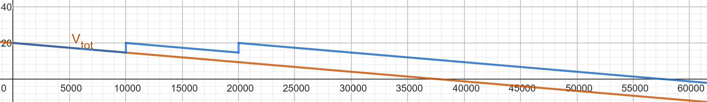

## Technical
Of course a telegraph, like pretty much everything else on this planet, comes with some kind of numbers or formulas. 

As we read in the previous "How it works" chapter, we know that an electrical pulse for the code is sent as soon as the key is pressed downwards. The battery connected basically now has a road without disruptions towards the Ground, even though the ground is located many kilometres away. The voltage of the battery does, in fact, make a difference, and we will see why now.  

We will start with the basics. In a simple circuit consisting of a battery, a wire and a consumer, we have the simple formula of Ohm's Law:    
$V = R \cdot I$  
where $V$ is the voltage supplied by the battery, $R$ is the resistance of the consumer, in our case the electromagnet or the cable itself, and $I$ is the current flowing through the circuit. 
When the telegraph key is pressed down, the entire system is nothing more of a simple circuit with a battery, a button, wire, and a light bulb or a buzzer or some other mechanism on the other side that uses the electricity to signify a message. 
In small circuits, wire resistance is practically none, however over many kilometres, the wire adds a significant resistance to the circuit, which drops the voltage significantly over distance. 

We can calculate the **resistance of the wire** using this formula:  

$R_{\text{wire}} = \rho \cdot \frac{L}{A}$

$\rho$ is the resistivity of the wire material (measured in ohm metres, in copper wires it is about $1.7 \cdot 10^{-8}  \Omega \cdot m $)  
$L$ is the length of the wire
$A$ is the cross-sectional area of the wire in $m^2$

Let us visualise this with an example. City A wants to communicate with City B using a telegraph. City B has a sounder that needs a minimum of 3V to operate. Historically, a sounder needed between 20 and 50mA to operate as well. So we will go with 25mA. The two cities are separated by 20km, and the telegraph runs with a copper wire with a 1mm diameter. To calculate the ideal voltage, the battery should have at City A, let's first calculate the voltage drop (aka the lost voltage due to wire resistance) over this distance.  
To calculate $R_{wire}$, we can simply plug in all our values into the formula given above. $R_{wire} = 1.7 \cdot 10^{-8} \cdot \frac{20000m}{\pi \cdot 0.0005^2m^2}$ 
Calculating this gives us a total resistance of $432.9 \Omega$. 
Now we can calculate the voltage drop using ohm's law. $V_{drop} = 432.9 \Omega \cdot 0.025A$ which equals to $10.8V$. So, over this distance, the cable will result in the sounder (City B) receiving 10.8 Volts less than what the battery in City A supplies. Knowing that the sounder needs at least 3V to activate, we can just add that to the voltage drop and figure out the minimum voltage our battery in City A needs to supply. $10.8 + 3 = 13.8$ V. Of course there's also some other natural phenomena like ground resistance, the connections of the wires having resistance, etc... So using the bare minimum of 13.8V probably still won't work realistically, since these formulae all assume ideal conditions. Using two 9V batteries in series, equalling 18V in total, should do the trick in this example setup. 

Here is a table with materials and their respective resistivity, aka how much resistance they have over distance. 
Silver would be better, but since it's so expensive and only slightly better, copper is best. 

In the last chapter, I showed that a relay is necessary. Let's look at the maths behind a relay station.
We can calculate a bunch of things related to the relay station, but first let's derive some new formulas.
Define a maximum allowable voltage drop as a percentage $k$. 

$V_{drop}=k\cdot V_{initial}$

Where $k$ is a fraction, for example 20% e.g. 0.2 that represents the maximum voltage that can be lost due to cable resistance before we need to "up" it again using a relay.
We also know that $V_{drop}$ is defined as 
$V_{drop}=R_{cable}\cdot I =\frac{\rho L}{A} \cdot I$
as written above. We can set the two equal and solve for L.

$k\cdot V_{initial}=\frac{\rho L}{A}\cdot I$

$L_{max}=\frac{k\cdot V_{initial} \cdot A}{\rho \cdot I}$

Our new formula simply spits out the length in metres before the battery falls under the minimum required voltage due to cable resistance. You could also not use a maximum voltage loss as a percentage, but simply define it as a fixated minimum voltage, below which it should not fall.

$L_{\text{max}} = \frac{(V_{\text{source}} - V_{\text{min}}) \cdot A}{\rho \cdot I}$

$V_{min}$ is the minimum require voltage the sounder in City B requires. 

The first formula asks: "How many metres until the voltage drops below, e.g. 50% of the original supplied voltage?"
and the second one: "How many metres until the voltage drops below, e.g. 3V?"

It is best to use the same voltage source in each relay, and also the same one as used in the key originally. But of course, you can change this, you would just have to recalculate everything for every bit of distance between two voltage sources.
Let's look at these two formulas with the example from above. These are the given values from before:
$r_{wire} = 0.5\text{mm}$
$L_{wire} = 90\text{km}$
$V_{min} = 3\text{V}$
$I = 0.025 \text{A}$
we will give City A a 20V battery to work with. The wire is made of copper, to keep it realistic.
With a simple calculation of the voltage drop from a formula mentioned further up:

$R_{wire} = \rho \cdot \frac{L_{total}}{\pi r_{wire}^2}$

$R_{wire} = 1.7\cdot 10^{-8} \cdot \frac{90000}{\pi \cdot 0.0005^2} = 1948.1 \Omega$

$V_{drop} = R_{wire} \cdot I$

$V_{drop} = 1948.1 \Omega \cdot 0.025 \text{A} = 48.7\text{V}$

We will lose 48.7V of our original 20V, which of course means we will completely lose all of our voltage and the sounder in City B will not work. This telegraph system definitely needs some relay stations. Each relay will be fitted with the same battery as the original, so 20V. 
Let's calculate every how many kilometres we need to place one. We will use this formula: 

$L_{max} = \frac{(V_{relay} - V_{min})\cdot A_{wire}}{\rho \cdot I}$

$L_{max}=\frac{(20\text{V}-3\text{V})\cdot \pi \cdot 0.0005^2}{1.7\cdot 10^{-8}\cdot 0.025 \text{A}} = 31415 \text{m} = 31.4\text{km}$

We need to place a relay station every 31.4km to ensure that the sounder in city B gets activated. Ideally, we want even more voltage in city B, since this formula gave us the minimum theoretical distance under ideal conditions. At the end, we should get a voltage of 5.3V, which is good for our minimum needed voltage of 3V.

### The Maths
Let's summarise all previous formulas and also rewrite them as mathematical functions for easier use.
Since we now know that

$R_{wire}=\rho_{material}\cdot \frac{L_{wire}}{A_{wire}} =\rho_{material}\cdot \frac{L_{wire}}{\pi r_{wire}^2}$

We can rewrite this as a function of the length. The function takes in the length of the cable and outputs the total resistance the cable has.

$R(L)=\rho \cdot \frac{L}{A}$

Where $\rho$ and $A$ are constants.
Furthermore, we know that the voltage drop can be calculated by 

$V_{drop} = R_{wire} \cdot I_{required}$

Therefore, the total voltage after a specific length of cable is

$V_{total} = V_{initial} - V_{drop}$

Now we can replace all known functions and rewrite the voltage after a given length of cable as a function in terms of the length of cable

$V_{total}(L)=V_{initial} - V_{drop} $

$V_{total}(L)=V_{initial} - R_{wire} \cdot I_{required}$

$V_{total}(L)=V_{initial} - R_{wire}(L) \cdot I_{required}$

$V_{total}(L)=V_{initial} - (\rho_{material}\cdot \frac{L}{\pi r_{wire}^2}) \cdot I_{required}$

$V_{total}(L)=V_{initial}-\rho_{material}\cdot \frac{L}{\pi r_{wire}^2}\cdot I_{required}$

Below is a picture of a graph of that function using the following values for the constants:
$\rho = 1.68\cdot 10^{-8} \Omega\cdot m $ (copper wire)
$r_{wire}=0.0005m=0.5mm$
$I_{required}=0.025A=25mA$
$V_{initial}=20V$

After about 37.5km, the voltage will have reached zero. Let's add a relay at the 10km and 20km mark.

The relay boosts the voltage up and basically refreshes the circuit again. With just two relays, the cable now can reach up to almost 60km. Adding relays after 10km was slight overkill as we have barely lost a quarter of the original voltage, but the idea gets demonstrated well enough.

I hope this chapter illustrated the importance of a relay station.  